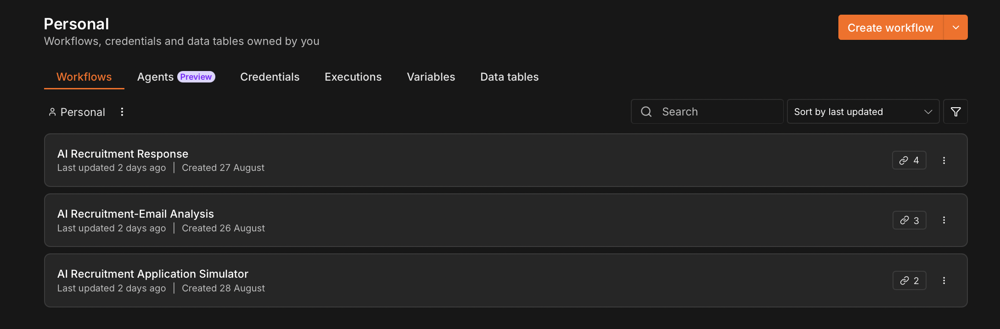
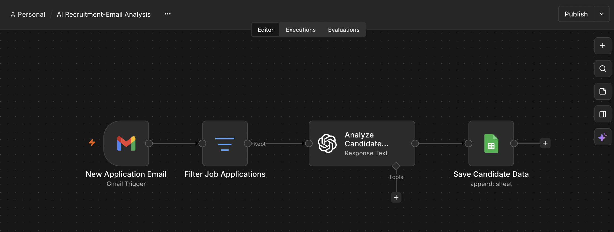
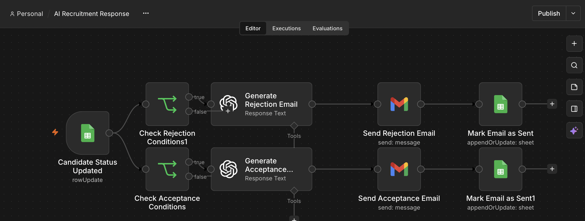
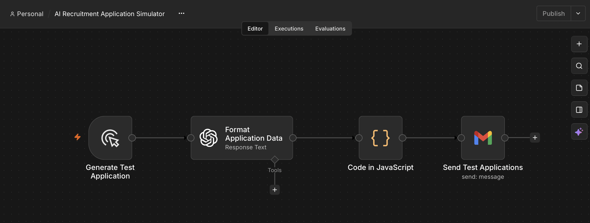

# AI Recruitment Automation

An AI-powered recruitment automation system built with **n8n, OpenAI, Gmail, and Google Sheets**.

## About the Project

I built this project for a friend who is a company director and was receiving a large number of job applications by email.

Manually reviewing applications, extracting candidate information, organizing candidates, and responding to applicants was taking a significant amount of time.

I designed and built this automation to solve that real-world problem by reducing repetitive manual work and creating a more structured recruitment workflow.

The system uses AI to assist with application analysis, candidate information extraction, scoring, and response generation, while the final hiring decision always remains with a human.

## How It Works

The system consists of three n8n workflows that work together.

### 1. Test Application Generator

Generates fictional job applications with different experience levels, technical skills, and qualifications and sends them to a test Gmail account.

This workflow was created to test the complete recruitment automation with different candidate profiles.

### 2. Application Analysis

When a new job application arrives:

**Gmail → Filter → OpenAI → Google Sheets**

The workflow:

- Detects incoming job applications
- Filters emails based on the subject
- Sends the application content to OpenAI
- Extracts structured candidate information
- Evaluates relevant technical experience
- Calculates a candidate score
- Creates a screening recommendation
- Stores the results in Google Sheets

### 3. Candidate Response

After the candidate information is added to Google Sheets, a human reviews the candidate and selects one of three statuses:

- **APPROVED**
- **REJECTED**
- **PENDING**

The response workflow then uses the selected status to determine what happens next.

**APPROVED**

OpenAI generates a professional email informing the candidate that the company would like to continue with the next stage of the recruitment process.

**REJECTED**

OpenAI generates a polite and professional rejection email thanking the candidate for their application.

**PENDING**

No email is sent. The candidate remains available for further human review.

After an email is successfully sent, the `Email Sent` field is updated from `NO` to `YES`.

## Human-in-the-Loop

A key part of the system is that **AI does not make the final hiring decision**.

AI is used as an assistant to:

- Analyze applications
- Extract and structure information
- Support the initial screening process
- Calculate a screening score based on predefined criteria
- Generate professional candidate responses

The final decision is made by a human.

The recruiter reviews the information in Google Sheets and manually chooses:

**APPROVED / REJECTED / PENDING**

This approach uses AI to reduce repetitive work while keeping human control over the recruitment decision.

## Candidate Evaluation

Candidates are evaluated using predefined, job-related criteria for an **Automation QA Engineer** position.

The evaluation considers factors such as:

- QA / Automation Experience
- Python
- Playwright
- API Testing
- SQL
- CI/CD
- Git
- Docker
- Agile/Scrum

The AI is instructed to award points only when relevant experience or skills are explicitly mentioned in the application.

It does not assume missing information or invent qualifications.

The screening score is intended only as an objective screening aid and is not a replacement for human judgment.

## Technologies

- **n8n** — workflow automation and orchestration
- **OpenAI** — AI-powered analysis and response generation
- **Gmail** — receiving and sending applications and responses
- **Google Sheets** — structured candidate data and human review
- **JSON** — workflow data and structured AI output
- **Markdown** — prompt and project documentation

## Key Features

- AI-powered job application analysis
- Automated candidate information extraction
- Structured candidate data
- Candidate scoring
- Screening recommendations
- Google Sheets integration
- Human-in-the-loop decision making
- Automated approved candidate responses
- Automated rejection emails
- Pending candidate handling
- Email sent tracking
- Fictional test application generation
- End-to-end workflow testing

## Project Structure

    ai-recruitment-automation/
    ├── README.md
    ├── workflows/
    │   ├── 01-test-application-generator.json
    │   ├── 02-application-analysis.json
    │   └── 03-candidate-response.json
    ├── prompts/
    │   ├── candidate-analysis.md
    │   ├── candidate-response.md
    │   └── test-application-generator.md
    ├── data/
    │   └── sample-candidates.csv
    └── screenshots/
        ├── 01-overview.png
        ├── 02-application-analysis.png
        ├── 03-candidate-response.png
        ├── 04-google-sheets-results.png
        ├── 05-google-sheets-details.png
        └── 06-test-application-generator.png

## Testing

The system was fully tested using multiple fictional job applications with different:

- Experience levels
- Technical skills
- Qualifications
- Candidate scores
- Screening recommendations

The complete workflow was tested from:

**Application Email → AI Analysis → Google Sheets → Human Decision → AI Response → Gmail → Google Sheets Update**

The test application generator was also used to send multiple applications to the test inbox in order to verify that the automation worked correctly across different candidate profiles.

## Test Data

All candidate profiles and application data used in this repository are fictional and were created for testing and demonstration purposes.

No real candidate personal information is included.

The test environment uses fictional candidate names, email addresses, phone numbers, qualifications, and professional experience.

## Responsible AI

The AI is used only as a recruitment assistance and automation tool.

It helps reduce repetitive administrative work, structure candidate information, support initial screening, and generate candidate communication.

**AI does not make the final hiring decision.**

The final decision is always made by a human recruiter or decision-maker.

The system is designed to evaluate candidates using job-related information and avoid using sensitive personal characteristics such as:

- Age
- Gender
- Nationality
- Ethnicity
- Photographs
- Religion
- Political beliefs
- Health information

The candidate score is an automation aid and should not be treated as an automatic hiring decision.

## Screenshots

### Workflow Overview

### Application Analysis Workflow

### Candidate Response Workflow

### Google Sheets Results

### Google Sheets Candidate Details

### Test Application Generator

## What This Project Demonstrates

This project demonstrates practical experience with:

- AI workflow automation
- n8n workflow design
- LLM integration
- Prompt engineering
- Structured AI output
- Conditional logic
- Email automation
- Google Sheets integration
- Data extraction and transformation
- Human-in-the-loop systems
- Business process automation
- Test data generation
- End-to-end workflow testing

## Project Outcome

The result is an automated recruitment workflow that can take a job application from an incoming email, analyze and structure the candidate information, store it for human review, and automatically generate the appropriate candidate response based on the recruiter's decision.

The project demonstrates how AI and workflow automation can be applied to solve a practical business problem and reduce repetitive administrative work while keeping important decisions under human control.

## Author

Built as a practical AI automation project to solve a real-world recruitment workflow problem for a company director.